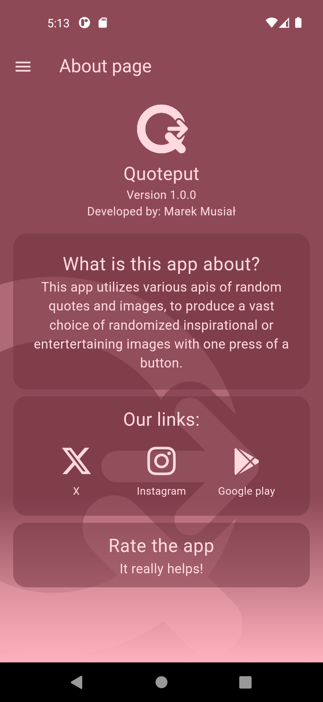

<!DOCTYPE html>

<body>
  

    
    
<b>Quoteput</b>

    
A wide range of quote images - just one tap away!

  

</body>

  
Table of Contents

  <ol>
    <li><a href="#readme-top">Quoteput</a></li>
    <li><a href="#about-the-app">About the app</a>
      <ul>
        <li><a href="#examples">Examples</a></li>
      </ul>
    </li>
  <li><a href="#what-else-can-it-do">What else can it do?</a></li>
  <li><a href="#my-links">My links</a></li>
  </ol>

---

This mobile app utilizes various APIs of random quotes and images, 
to produce a vast choice of randomized inspiring images with one press of a button.

[!WARNING]
Some quotes and images may use strong language, reflect unpopular views and opinions, or be straight up wrong. The app was created for entertainment only. <b>User discretion is advised.</b>
 

  &nbsp;
  &nbsp;
  

## About the app

  

    

    With a single button press, get a random image and quote combo.
    The outcome may vary from inspirational to entertaining (or even a bit menacing).
    Each time a call is made, a random API is chosen from a list resulting in more unique images.
    

  

### Examples:

  &nbsp;
  &nbsp;
  
   
  &nbsp;
  &nbsp;
  

## What else can it do?

  

    

      

      Easily <b>save the image</b> you like to your phone gallery or <b>share</b> it with friends.
      

    

  
  

  

    
    

      

        <b>Change theme brightness and color</b>, or <b>choose dynamic color theme</b> based on currently displayed image colors.
      

    

  

  

    

      

      <b>Check out all the APIs</b> currently used in the 'Sources' list.
      

    

  
  

  

    
    

      

        <b>Learn more</b> about the app, check out my <b>social media</b> and <b>rate the app</b>.
      

    

  

<h2 align="center"> My links:</h2>

  
  &nbsp;&nbsp;&nbsp;&nbsp;
  

 
 

(<a href="#readme-top">back to top</a>)

