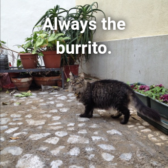
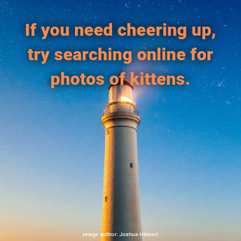

# Quoteput

A wide range of quote images - just one tap away!

## Need a quick inspiration?

This app utilizes various APIs of random quotes and images, to produce a vast choice of randomized inspiring images with one press of a button.

## How does it work?

With a single button press, get a random image and quote combo.
The outcome may vary from inspirational to entertaining (or even a bit menacing).
Each time a call is made, a random API is chosen from a list resulting in more unique images.

### Examples:
&nbsp;
&nbsp;

 
&nbsp;
&nbsp;

## What else can it do?

- Easily **save the image** you like to your phone gallery or **share** it with friends.

- **Change theme brightness and color**, or **choose dynamic color theme** based on currently displayed image colors.

- **Check out all the APIs** currently used in the 'Sources' list.

## My links

- [x.com](https://x.com/MarekMusialDev)
- [Instagram](https://www.instagram.com/marek.musial.dev/)
